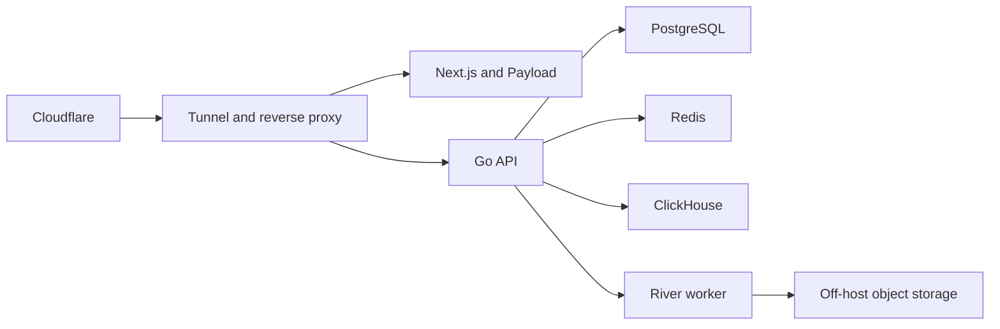

# Stage 0 architecture

The initial deployment is a modular monolith on one OVH host. One repository and
release process own the system, while processes and data stores remain isolated.

Only the data plane is represented in the current Compose file. Application and
edge services will be added with their first working implementation.

## Trust boundaries

- `app_internal`: application-to-data traffic only; no host port publishing.
- Secret files: created on the target outside Git and mounted read-only.
- Persistent volumes: stateful and never removed by an automated validation job.
- GitHub pull requests: validation only, without production credentials.
- Production deploy: future protected GitHub environment and immutable image digests.

## Capacity constraints

The purchased host has 4 cores / 8 threads, 32 GB ECC RAM, two 480 GB SATA SSDs in
RAID1, and a 500 Mbit/s public link. Builds, Postal, Plausible CE, media originals,
raw imports, and long-term backups stay off-host.
