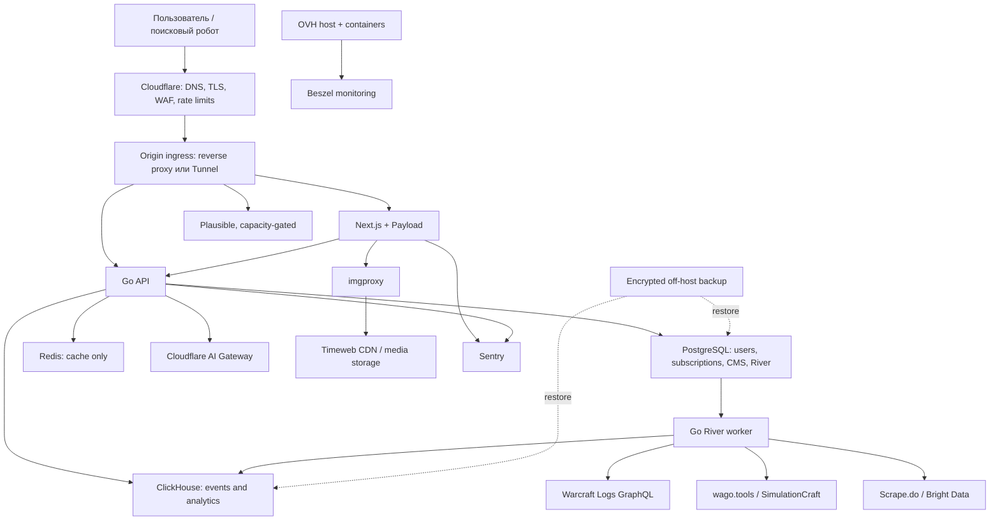

# Архитектура Gildra

## Текущее и целевое состояние

Сейчас существует только инфраструктурный scaffold для PostgreSQL, ClickHouse и
Redis. На сервере нет Docker, `/srv/gildra` и runtime Gildra. Схема ниже —
целевая архитектура, а не список уже работающих сервисов.

Core application остаётся модульным монолитом: один продукт, согласованный
release contract и один production host на старте. Изоляция обеспечивается
отдельными процессами/контейнерами, networks, users, volumes и resource limits.
Cloudflare, Timeweb, Sentry, OAuth providers и data APIs являются внешними
зависимостями и не становятся частью физического монолита.

## Сетевые границы

- Из интернета публикуются только HTTPS и одобренный management SSH path.
- PostgreSQL, ClickHouse и Redis не публикуют host ports.
- `app_internal` остаётся internal Docker network.
- Origin принимает web-трафик только по выбранному Cloudflare-пути. Выбор между
  allowlisted origin и Tunnel делается после подтверждения IPv4/IPv6, console
  recovery и требований Cloudflare.
- LLMNR на публичном интерфейсе не требуется; изменение выполняется только
  отдельной host-hardening change card.
- OAuth callbacks, webhooks и AI endpoints получают отдельные rate-limit,
  authentication, replay-protection и logging policies.

## Размещение на текущем сервере

Известная конфигурация: 4 cores / 8 threads, 32 GiB ECC RAM, два SATA SSD
примерно по 480 GB в software RAID1 и public link 500 Mbit/s. Это достаточно для
раннего core stack, но не для безусловного запуска всех желаемых сервисов.

Начальный placement:

- host: Debian 12, Docker Engine/Compose, reverse proxy, backup client и
  минимальный monitoring agent;
- containers: Next.js/Payload, Go API, River worker, PostgreSQL, ClickHouse,
  Redis и imgproxy — только когда появились images и acceptance contracts;
- CI builds и Testcontainers: GitHub-hosted runners, не production;
- off-host: backup artifacts и как минимум одна копия media originals;
- capacity-gated: Postal, Plausible server, Beszel hub, тяжёлые imports и
  SimulationCraft batch jobs.

Postal особенно зависит не только от CPU/RAM: нужны DNS records, reverse DNS,
репутация IP, provider egress policy, bounce/complaint handling и отдельная
операционная ответственность. Его нельзя запускать просто как “ещё один
контейнер” в первой production-итерации.

До устойчивых измерений сохраняется не менее 20% filesystem headroom. На сервере
не выполняются image builds. Resource limits из Compose — guardrails, а не
гарантия capacity; они пересматриваются по p95 latency, memory pressure, IO wait,
ClickHouse merges, PostgreSQL checkpoints и queue lag.

## Data plane

### PostgreSQL

Хранит нормализованное транзакционное состояние. Goose/Payload migrations должны
быть versioned, reviewed и запускаться отдельным deploy step до переключения
traffic. Релиз обязан объявить backward compatibility и план recovery.

### Redis

Используется только как кеш. Текущий scaffold отключает persistence, поэтому
приложение обязано корректно переживать полную потерю keyspace и cache stampede.
Если Redis получит durable responsibility, архитектура и backup policy меняются
до deploy.

### ClickHouse

Начальная модель — immutable raw events плюс агрегаты для повторяющихся dashboard
queries. Конкретная schema создаётся только после появления event contract и
запросов.

- Producer сначала пытается делать прямые batch inserts. Async inserts
  рассматриваются при множестве маленьких записей; Kafka не добавляется без
  доказанной потребности в replay/decoupling.
- Incremental materialized views подходят для повторяющихся append-only
  агрегаций; raw table сохраняется для перерасчёта.
- Partitioning выбирается по retention operations. При небольшом неизвестном
  объёме допустим старт без partitioning; чрезмерно мелкие partitions запрещены.
- Частые runtime JOIN с медленными dimensions заменяются dictionaries,
  denormalization или materialized views только после измерения.
- Late-arriving data обрабатываются append/version semantics; массовые UPDATE и
  DELETE mutations не являются default-путём.

Рекомендации основаны на официальных руководствах ClickHouse по
[insert strategy](https://clickhouse.com/docs/best-practices/selecting-an-insert-strategy),
[incremental materialized views](https://clickhouse.com/docs/materialized-view/incremental-materialized-view),
[partitioning](https://clickhouse.com/docs/partitions) и
[ReplacingMergeTree](https://clickhouse.com/docs/en/guides/replacing-merge-tree).
Окончательный выбор требует event rate, batch size, query profile и retention.

## Secrets и identities

- Git содержит только названия secret references и example-файлы.
- Production secrets создаются в одобренном secret store или на target с
  документированным owner, permissions и rotation path.
- GitHub deploy identity должна быть короткоживущей и environment-scoped.
- OAuth/provider tokens не передаются frontend-клиенту и не попадают в Sentry,
  Plausible, ClickHouse или CI artifacts.
- Один token не должен по умолчанию давать доступ ко всем внешним integrations.

## Observability и readiness

Минимальные сигналы: внешний user path, request rate, error rate, p95 latency,
container restarts/saturation, release digest, PostgreSQL/ClickHouse health,
River queue lag, backup age и disk headroom. Каждый alert получает owner,
severity, sustained threshold и runbook.

Sentry отвечает за ошибки приложения, Plausible — за web analytics, Beszel — за
host/container telemetry. Ни один из них отдельно не доказывает readiness.

## Recovery boundary

RAID1 снижает риск отказа одного диска, но не является backup. Нужны encrypted
off-host backups, retention, immutable artifact identity и регулярный isolated
restore. Пока restore не выполнен и RPO/RTO не измерены, stateful production
deploy и destructive operations заблокированы.
